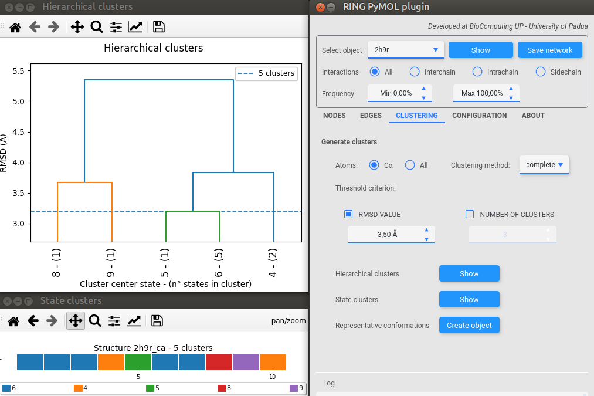

# RING PyMOL plugin

<!-- TOC -->
* [RING PyMOL plugin](#ring-pymol-plugin)
  * [Install](#install)
    * [Installation of PyMOL and python dependencies](#installation-of-pymol-and-python-dependencies)
      * [Installation of PyMOL with apt](#installation-of-pymol-with-apt)
      * [Installation of PyMOL with Conda from yml file (RECOMMENDED)](#installation-of-pymol-with-conda-from-yml-file--recommended-)
      * [Installation of PyMOL with Conda](#installation-of-pymol-with-conda)
    * [NOTE](#note)
    * [Install the RING plugin](#install-the-ring-plugin)
    * [Singularity container](#singularity-container)
* [Usage Instructions](#usage-instructions)
  * [Configuration](#configuration)
    * [RING](#ring)
    * [Visualization](#visualization)
  * [Executing RING and visualize the edges](#executing-ring-and-visualize-the-edges)
    * [Filtering the results](#filtering-the-results)
  * [Nodes](#nodes)
    * [Pairwise interaction plot](#pairwise-interaction-plot)
    * [Nodes interaction table](#nodes-interaction-table)
    * [Color nodes by interaction frequency](#color-nodes-by-interaction-frequency)
  * [Edges](#edges)
    * [Interaction plots](#interaction-plots)
      * [Chain interactions](#chain-interactions)
      * [Secondary structure interactions](#secondary-structure-interactions)
    * [Probabilistic interchain residue contact map](#probabilistic-interchain-residue-contact-map)
    * [Pairwise interaction correlation analysis](#pairwise-interaction-correlation-analysis)
  * [Clustering](#clustering)
    * [Calculation of the hierarchical clustering](#calculation-of-the-hierarchical-clustering)
    * [Clustering visualizations](#clustering-visualizations)
    * [Create object](#create-object)
  * [Example](#example)
<!-- TOC -->

## Install

### Installation of PyMOL and python dependencies

#### Installation of PyMOL with apt

- `sudo apt install pymol python3-pip python3-tk`
- `pip install pmw networkx numpy~=1.20 scipy seaborn pandas qt-material biopython requests`

#### Installation of PyMOL with Conda from yml file (RECOMMENDED)

- Install conda, following the instructions on their website
- Download the environment.yml file from this repository
- Create the environment with `conda env create -f environment.yml`
- Activate the environment with `conda activate ring-pymol-plugin`

#### Installation of PyMOL with Conda

- Install conda, following the instructions on their website
- Create a new environment and switch to it
    - `conda create -n myenv`
    - `conda activate myenv`
- Install PyMOL in the new environment
    - `conda install -c conda-forge -c schrodinger pymol-bundle` (shrodinger version)
    - `conda install -c conda-forge pymol-open-source` (open-source version)
- Install python dependencies for the plugin
    - `conda install networkx numpy scipy seaborn pandas requests biopython`
    - `pip install qt-material` (This will be installed in the conda environment)

### NOTE

Please check that the PyMOL executable that you are running is the one for which you installed all the dependencies.
E.g.
`which pymol` should return something like `/opt/miniconda3/envs/myenv/bin/pymol` if installed with the recommended
conda installation.

### Install the RING plugin

- Open PyMOL and go to Plugin > Plugin Manager > Install New Plugin > Install from Repository > Add..
    - Add https://ring.biocomputingup.it/plugin/
- Click on ring-plugin.zip in the right panel and then Install
- Set the installation directory
-
- The plugin should now appear on the Plugin menu of PyMOL

### Singularity container

Another option for installing the plugin is to use the singularity container definition file provided in this
repository.
To create the image file you can follow these steps:

- `sudo singularity build -F ring-pymol-plugin.sif singularity.def` (this will create the image file)
- `singularity shell --cleanenv --writable-tmpfs -B ~/.Xauthority ring-pymol-plugin.sif` (this will open a shell in the
  container).
  Note that the -B option is needed to allow the container to access the X server of the host machine for displaying the
  GUI.
- Start PyMOL with `pymol`
- Add a new directory where to find new plugins
    - Plugin > Plugin Manager > Settings > Add new directory...
    - Add `/opt`
- Restart PyMOL
- The plugin should now appear on the Plugin menu of PyMOL

# Usage Instructions

## Configuration

### RING

In the configuration tab you can configure the settings for the RING software

- If you want to execute RING locally or on a remote server using the RING WS APIs (https://ring.biocomputingup.it).
- The location of the RING executable, if it is placed on the default location it will be picked up automatically
- The options for the edge filtering
    - Multi: Computes multiple edges for a pair of nodes, filtering out connections triangular connections like the one
      showed in the image below. It retains the connection with the lower distance computed between the interacting
      atoms.

    - One:Return only the most valuable connection between two residues.

    - All: Return all the connections found.
- Sequence separation, the minimum distance that is required between two residues in the sequence to compute the
  interactions between them.
- Distance thresholds, the maximum distance that can exist between two atoms (or residues) to have a specific
  interaction
- Re-execute RING every time: use this checkbox if you want to override the save function for the RING results of the
  plugin and re-execute the software each time instead of filtering the stored result. Use this if you modified the
  object or if you loaded a different version of the same object.

### Visualization

This tab is reserved for settings of the CGO (the edges) and we can find settings regarding

- The width of the edge
- The transparency of the edge
- The color of the edge associated to each type of interaction calculated by RING

## Executing RING and visualize the edges

To run RING on a structure you can fetch a PDB structure from the PDB repository with the command `fetch PDB_ID`. Then
open the plugin and at the top check that the object you fetched is selected in the drop-down menu.

To run RING on that object press the `Execute RING` button. The RING software will be executed on the selected object.
You can see the execution progress on the progress bar that appears when the object is exported and loaded into RING.

The drawing of the computed edges is automatic and they will be filtered in compliance with the selected filters.

The edges are loaded as Compiled Graphic Objects (CGO) in PyMOL grouped by interaction type `obj_interactionType` and
finally all the interactions for that objects are placed in a group called `obj_edges`.

The shown interactions are shown state-by-state, meaning that the interactions are shown for a specific state. If you
navigate to different states the interactions will change showing the interactions for that particular state.

In the same way a selection for the nodes involved in a interaction is created, and all the selected nodes are placed in
a group called `obj_nodes`.

### Filtering the results

Use the switches and controls in the top bar to filter the edges computed by the RING software. If the analyzed object
has multiple states then you can filter the interactions by their frequency, setting a minimum and maximum frequency.
Interactions that have a frequency that is not in that range will be filtered out from the visualization.

To visualize the results click on the `Show` button if RING was already launched, or `Execute RING` on the object.

## Nodes

### Pairwise interaction plot

By creating a selection of exactly two residues, and selecting the selection in the top bar, it is possible to produce a
plot showing the interaction occurring during an MD simulation (or in a multi-state structure) between the two residues.
In this plot different series represent different types of interaction occurring. In the $x$ axis the number of states
is represented, while in the $y$ axis there is the distance of interaction.

### Nodes interaction table

Clicking on this button will open a new window containing a table where all the residues of the selected structure that
are interacting are listed, with their frequency of interaction for each type of possible interaction. This is useful
to see for example if a residue is involved in a certain type of interaction, and the frequency of this interaction
(when the structure has multiple states).

The rows of the table can be selected in order to create a new selection (`sele_rows`) in PyMOL with the selected
residues.
The selection can be expanded by clicking on multiple rows. To reset the selection one can delete it
from PyMOL and then restart to select new rows.

### Color nodes by interaction frequency

This option lets you color the residues of the selected object based on the frequency of interaction of a certain type.
The coloring is done using a heatmap, where the residues with the highest frequency are colored in blue, while the
residues with the lowest frequency are colored in white.
The frequency is computed on the number of states that a residue present the selected type of interaction over the
total number of states.

Select the interaction of interest and then click on `Color nodes` to color the nodes in the structure.

## Edges

### Interaction plots

The following two graphs are intended for giving a quick overview of the interactions occurring in the structure.

#### Chain interactions

This graph shows the interactions occurring between the different chains of the structure. The nodes of the graph are
the chains, while the edges are the interactions between the chains.

#### Secondary structure interactions

This graph shows the interactions occurring between the different secondary structure elements of the protein.
The nodes of the graph are the secondary structure elements, identified with $\alpha$ helices and $\beta$ strands.
The numbering of these elements is given starting from the N-terminus of the protein.
The edges are the interactions between the secondary structure elements.

### Probabilistic interchain residue contact map

This heatmap represents the probability of interaction between residues of different chains. The probability is computed
as the number of states in which the two residues are interacting over the total number of states.
The user can select different types of interactions using the drop-down menu. Showing `all` interactions will also show
intrachain interactions probabilities. Moreover, with `all` interactions, the probability of interaction between two
residues is computed as the number of any type of interaction between the two residues over the total number of states.
The heatmap can be zoomed and panned using the controls in the top bar, this can be useful to concentrate the plot in a
specific region (e.g. chain A interactions with chain B).

### Pairwise interaction correlation analysis

Correlation analysis can be performed by the plugin on the results of RING, to study correlations between contacts found
in a multi-state structure. Indeed, the correlation that the plugin computes is a correlation of the contacts over the
time variable. It is interesting to see if some contacts are in correlation over time because this can be a clear signal
of an allostery mechanism that is present in the protein of study, especially if the two contacts are located in
different regions in the protein.

With correlation one can see if two contacts are present in the structure at the same time for a repeated number of
times, or, if they anti-correlate, they are present most of the times alternatively. The plugin computes the correlation
matrix given the contact maps produced by RING, and produce a table that summarize the results.

For this analysis different settings for the creation and filter of the correlation matrix are available. One important
thing is to limit the number of spurious contacts by setting a minimum frequency of contact, and at the same time
removing the ones that are constantly present in the structure. This limits the number of results that would have small
significance. Once the correlation matrix is produced more filters can be applied to it, removing points where the
correlation coefficient is not high or low enough, or filtering on the p-value of the correlation. For further reading
on how the coefficient is computed and what the p-value is please refer
to https://docs.scipy.org/doc/scipy/reference/generated/scipy.stats.pearsonr.html

The results of the calculation is a table composed by various column, from left to right we find:

- The first edge composed by the two residue in contact
- The frequency of the first edge in the multi-state structure, for the indicated type
- The type of interaction of the first **and** second edge, when the interaction type is *ALL* this means that all the
  interactions between the two edges were taken in consideration to compute the correlation value and p-value.
- The second edge composed by the two residue in contact
- The frequency of the second edge in the multi-state structure, for the indicated type
- The correlation value of the two edges
- The p-value of the two edges

Rows of the table can be filtered on all the columns, multiple additive filters can be set using the space as separator.
So if one wants to filter on rows that contains as part of edge_1 or edge_2 the chain A and have a correlation value of
0.8 for HBOND interactions can write: `A/ 0.8 HBOND`

Rows can also be selected (with multi-selection active, with `↑Shift` or `ctrl` ), and by pressing on
the `Visualize selected` button the two selected edges (if only one row selected) will be created in the PyMOL
interface, and two selections will be created containing the residues of edge_1 and edge_2. This has been done to
highlight the correlating interactions, that can be further analyzed with other features of the plugin, such as the
residue pair interaction plot on the two edges to confirm that the correlation or anti-correlation is present.

## Clustering

When dealing with large multi-state structures like molecular dynamics simulations it can be helpful to reduce the
number of states in the structure to better analyze some feature of the simulation. Moreover, with clustering one can
see if there is some kind of pattern in the simulation, and some interesting to study conformational states are emerging
during the simulation.

### Calculation of the hierarchical clustering

The plugin provides a simple way to perform clustering analysis on the structures loaded into PyMOL. The clustering that
the plugin provides is a hierarchical clustering based on RMSD distances calculated between all the states $(n\times n)$.
By default the clustering is done only on the $C\alpha$ atoms, so it can be faster to compute, but if it is
necessary one can change it taking in consideration all the atoms in the structure.

The clustering method to compute the linkage matrix can be changed, and it can be one of the ones described
here: https://docs.scipy.org/doc/scipy/reference/generated/scipy.cluster.hierarchy.linkage.html

The clustering will be computed on demand, when the user wants to get one of the two plots to visualize the clustering
or wants to generate a new object with the representative states of the clustering. Once the hierarchical clustering is
computed, the hierarchical tree can be cut in two ways, by RMSD value or by number of desired clusters. Different cuts
produce different results, that can be confronted with the two proposed visualizations.

### Clustering visualizations

Two different plots can be produced with the results of the clustering, giving the user an idea of the distribution of
the clusters, their densities and separations.

The first plot is the Hierarchical Clustering Plot, which shows the hierarchical tree of the computed clustering,
relative to the cut that the user selected. In the **x** axis the labels are composed by **cluster representative -(#
states in cluster)**, where the cluster representative is the state that has the lower sum of distances between all the
other states in the same cluster.

The second plot represent each state individually as a cell, and a color is assigned to it based on the membership
cluster. This can show if there are stable conformation during the simulation, and if some conformation is repeated
during time. Moreover, each cluster is represented by a color, and to that color the representative state of that
cluster is associated. The user can interact with plot by positioning the mouse over a cell, and a label will appear,
showing the state number of the selected cell and the relative cluster representative.

Once the appropriate number of cluster is selected (via RMSD or explicitly), the user can press the "Create object"
button. This will extract the representative cluster states and stitch them together in a new PyMOL object. This new
object can be used for further analysis with other features of the plugin.

### Create object

Clicking on this button will apply the previously selected clustering and will create a new object with only the
clustering representative states of the original object.

## Example

The plugin can be tested with the following example:

1. Download the multi-state structure 2H9R from PDBe-KB
    - Type `fetch 2h9r` in the PyMOL command line
2. Load the plugin in PyMOL
    - `Plugin` $\rightarrow$ `Ring plugin` or type in the command line `ring_plugin`
3. Now the plugin should be loaded, and in its top bar there should be already selected the PyMOL object 2h9r, the
   structure that you previously loaded.
4. Now you can execute RING with the button `Execute RING`
    - This will run the RING executable (if present) on the selected object, or it will try to execute RING on the
      selected structure on a web server using the APIs.
5. Once the results are ready they will be parsed and visualized on the structure in the PyMOL interface.

    

6. Now the edges can be filtered based on the type of interaction, frequency, and all the various tools can be used.
   E.g. we can see the `probabilistic interchain residue contact map` of the $\pi-\pi$ stack interactions:

   

       
   

7. Finally, we can also try to cluster a multi-state object, with a RMSD-based clustering. We can for example set a
   threshold criterion on the RMSD value for cutting the hierarchical clustering, yielding a certain number of clusters.
   Otherwise, one can select the exact number of clusters, and the RMSD value for the cut will be calculated
   automatically. One example is the following, were we set a RMSD cut value of 3.5 $\AA$, yielding 5 different
   clusters:

   

       
   

